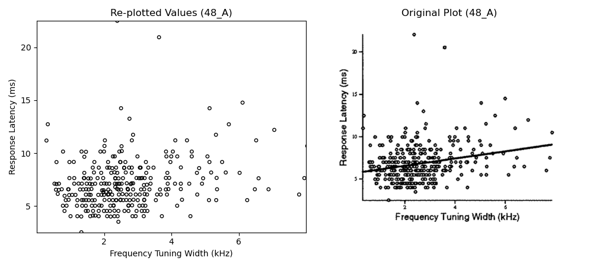
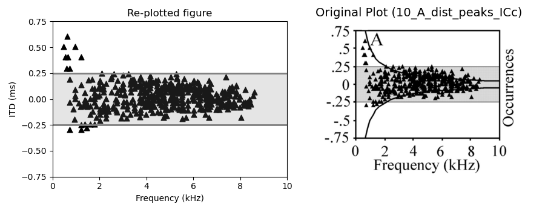

# Plot Data Extraction Toolkit

> Extract, clean, and re-plot numerical data from figures published in research papers—so you can finally put those JPEGs to work in your analyses.

# Project Overview

Research papers are full of valuable data locked inside static figures for which data is sometimes not publically published. This toolkit uses WebPlotDigitizer (automeris.io) and Python to:

- **Calibrate** chart axes with precision
- **Extract** raw data points (manually or via template matching)
- **Store** extraction sessions for easy re-calibration
- **Save** cleaned data as CSVs
- **Re-plot** against the original figure for verification

Whether you’re reproducing published results or building your own meta-analysis, this repo makes figure→data friction a thing of the past.

# Key Highlights

* **Reproducibility:** Store full digitizer projects to revisit and refine extractions.
* **Automation-Friendly:** Bulk-process dozens of figures with a single Python script.
* **Transparent:** Visual checks built into notebooks to ensure data integrity.
* **Skills**: Demonstrates proficiency in open-source tools, Python scripting, and data wrangling.

# Sample Outputs (Original vs Re-plotted) 

### Example 1: Plot B from page 40 of the paper

**Original figure**

 

**Extraction in WebPlotDigitizer**: How the digitizer looked after template-matching and cleanup.
  

**Re-plotted with Regression**
* Final overlay of extracted points and fitted regression line.
  

---

### Example 2: Plot A from page 48 of the paper. 
* Final overlay of extracted points vs original data
  

---

### Example 3: Original vs Re-plotted: Plot 3A from page ICC_ICX paper. 
* Final overlay of extracted points vs original data
  

---

### Example 4: Original vs Re-plotted: Plot 10_A from page ICC paper. 
* Final overlay of extracted points vs original data
  

---


# Tech Stack

- **[WebPlotDigitizer](http://automeris.io/WebPlotDigitizer/)** for interactive digitization  
- **Python 3.8+** with:
  - pandas  
  - matplotlib  
  - numpy  

# Repository Structure

```

.
├── automeris\_calibration\_details/       # JSON/YAML exports of axis calibrations
├── automeris\_projects\_each\_plot/       # .tar project files for each extraction session
├── main\_code\_dir/                      # Python scripts for automated re-plotting
├── plot\_data\_files/                    # CSVs of extracted data (e.g. 40\_B.csv)
├── plots\_images/                       # Screenshots of original figures
├── screenshots\_of\_data\_extraction/     # How each chart looked in WebPlotDigitizer
├── re-plotting.ipynb                   # Jupyter notebook: compare extracted vs. rounded vs. original
└── re-plotting-for-plots-that-need-rounding.ipynb

````

> **Naming convention:** `<page>_<plot_label>.csv` (e.g. `40_B.csv`).

# Getting Started

1. **Clone the repo**

   ```bash
   git clone https://github.com/your-username/figure-data-extraction.git
   cd figure-data-extraction


2. **Install dependencies**

   ```bash
   pip install -r requirements.txt
   ```

3. **Open a notebook**

   ```bash
   jupyter lab
   ```

   * Launch **re-plotting.ipynb** to see side-by-side comparisons.
   * Tweak **automeris\_projects\_each\_plot/** files and re-run extraction anytime.

# Typical Workflow

1. **Calibrate axes** in WebPlotDigitizer (set X1, X2, Y1, Y2).
2. **Extract points**

   * Manual clicking
   * Or “Template Matching” + clean-up
3. **Export**:

   * `.csv` for numbers
   * `.tar` project file for future edits
4. **Re-plot** using provided scripts/notebooks
5. **Validate**: visually confirm accuracy against original image

# Future Improvements

* Add CLI interface for headless batch extraction
* Integrate unit tests for calibration accuracy
* Package as a PyPI module

# Acknowledgments

Special thanks to **Dr. Brian Fischer** for his invaluable guidance and mentorship on this project, and for his extraordinary work in auditory neuroscience research. This tool was built as part of our ongoing research in understanding population-level auditory coding in barn owls.

* **Contact**: rsyeda@seattleu.edu
* **Project by**: Ruqhaiya Fatima Syeda

For further details or to collaborate, feel free to reach out or explore the project. 

